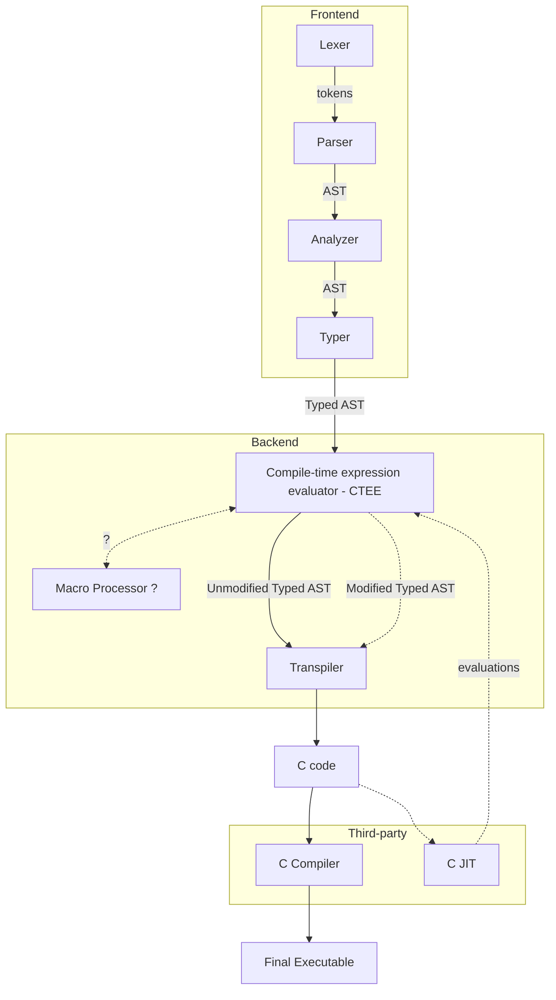

# rylang

A programming language in progress, which this repository will host the compiler of.

See [docs/spec.md](docs/spec.md)

For ease of reading the Markdown files, I recommend opening them up in VSCode

TODO: Link to external Markdown reader, for example: https://dillinger.io/ (this one is broken with custom heading ids)

TODO: clean up `lexer.c`, `lexer.h` and `ry.c` \
TODO: add character literals to the spec \
TODO: finish the lexer - match with the spec

# Compiler



# Overview

TODO

```rust
ast = import "ast";
Pair[T ast:Node & type] => ast:Node & struct = [
    a T;
    b T;
]
main[] => [] = {
    pair Pair[i32] = [1; 2]
    sum i32 = pair.a + pair.b; // 3
    dif i32 = pair..0 - pair..1; // -1
}
```
