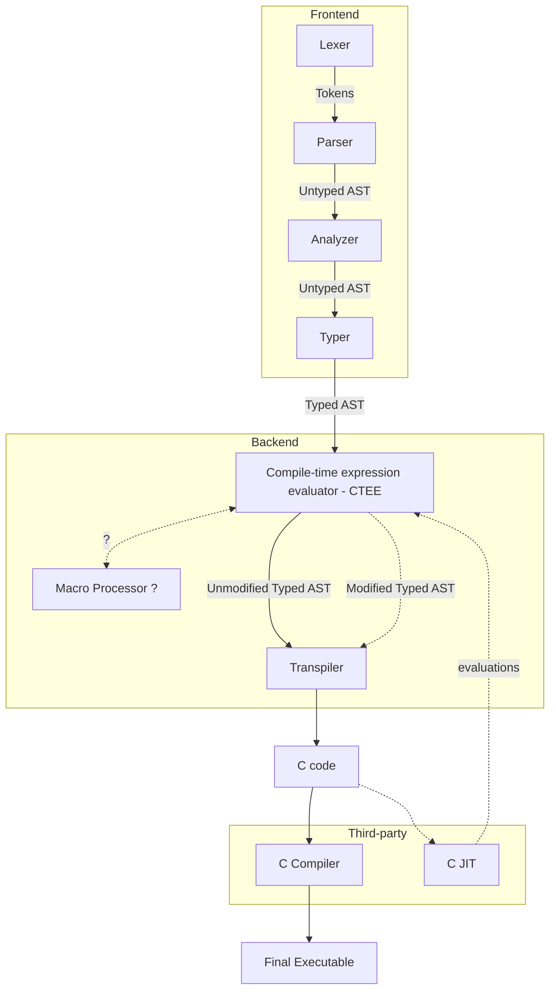

# rylang

A programming language in progress, which this repository will host the compiler of.

See [docs/spec.md](docs/spec.md)

For ease of reading the Markdown files, I recommend opening them up in VSCode

# TODO

-   Link to external Markdown reader, for example: https://dillinger.io/ (this one doesn't work with custom heading ids)
-   Better error messages and handling
-   Perhaps separate all stringify functions in `ASTNode` into its own `Stringifier` class

# Compiler



# Overview

TODO

```rust
ast = import "ast";
Pair[T ast:Node & type] => ast:Node & struct = [
    a T;
    b T;
]
main[] => [] = {
    pair Pair[i32] = [1; 2]
    sum i32 = pair.a + pair.b; // 3
    dif i32 = pair..0 - pair..1; // -1
}
```

# Installing

1. Get meson with `pip3 install meson`
2. Get [ninja](https://github.com/ninja-build/ninja/releases)
3. Run `setup.bat`

# Building

Run `build.bat`

# Running

Run `run.bat`
