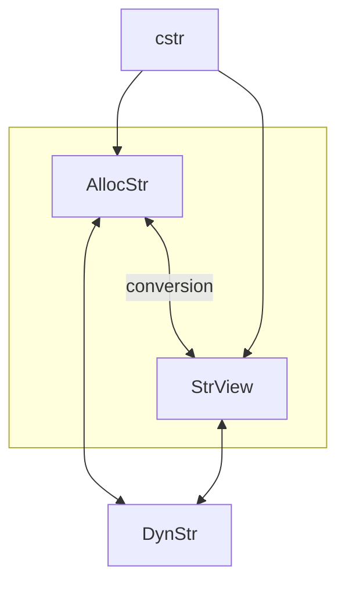
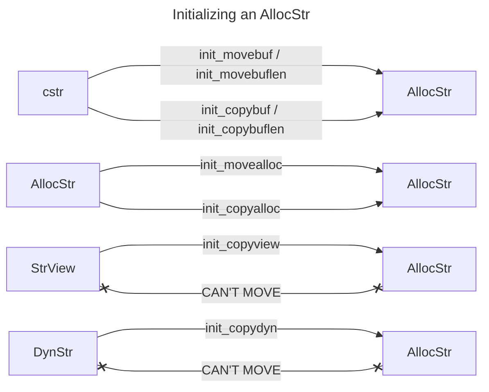
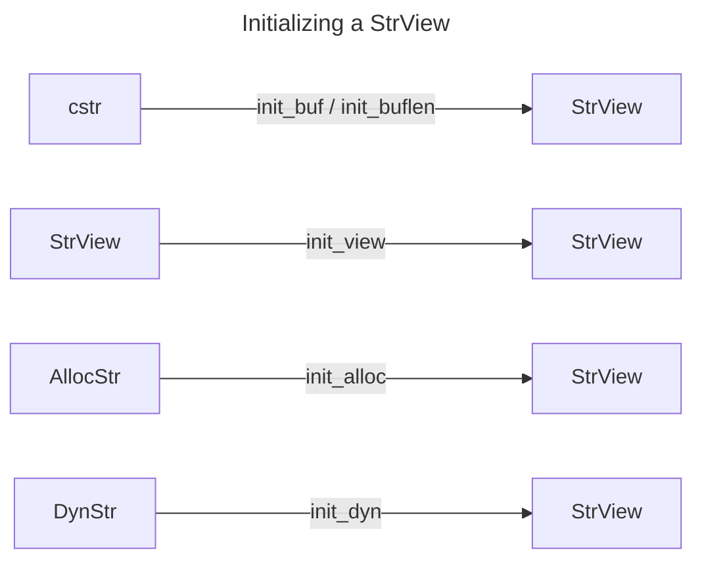

| Module    | Struct     | Description                                     |
| --------- | ---------- | ----------------------------------------------- |
| cstr      | -          | Utility functions for C-style strings (buffers) |
| str_view  | `StrView`  | String View                                     |
| alloc_str | `AllocStr` | Allocated String                                |
| dyn_str   | `DynStr`   | Either an `AllocStr` or `DynStr`                |

---

**AllocStr**
[alloc_str.h](alloc_str.h)

---

**StrView**
[str_view.h](str_view.h)

As this is a "view", all `init` functions move the data and do not copy it.

